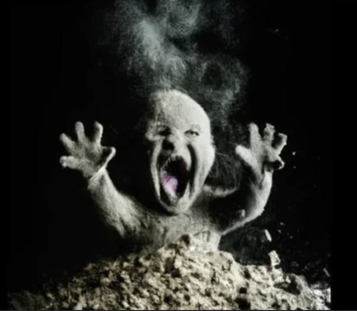
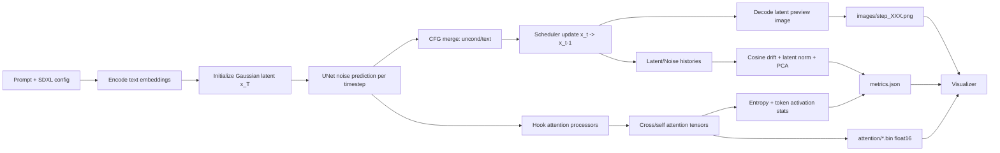
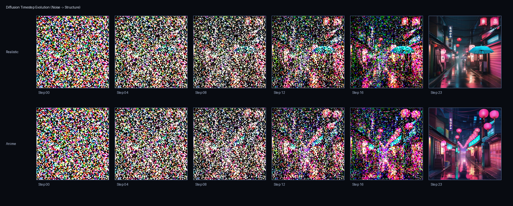
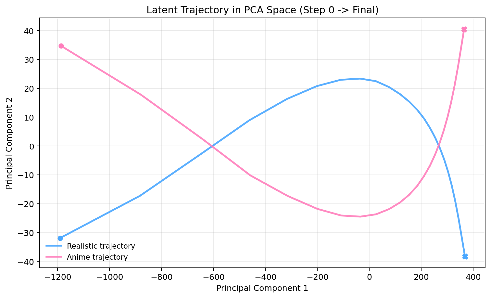
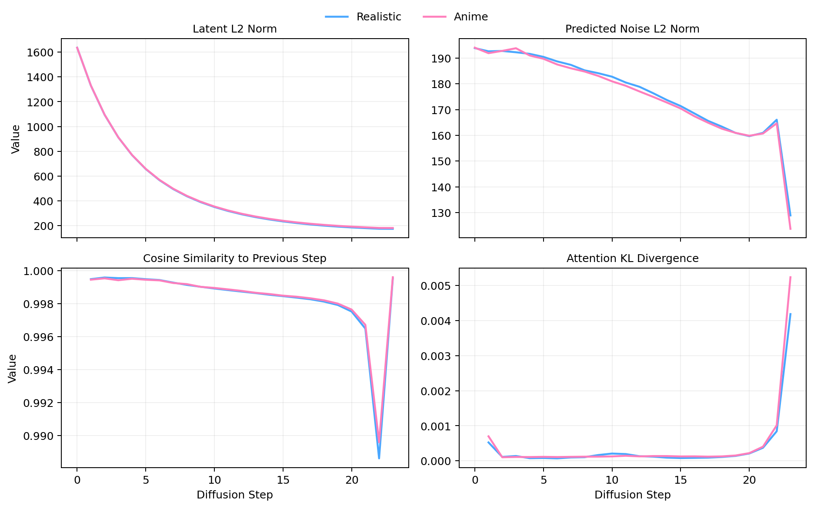
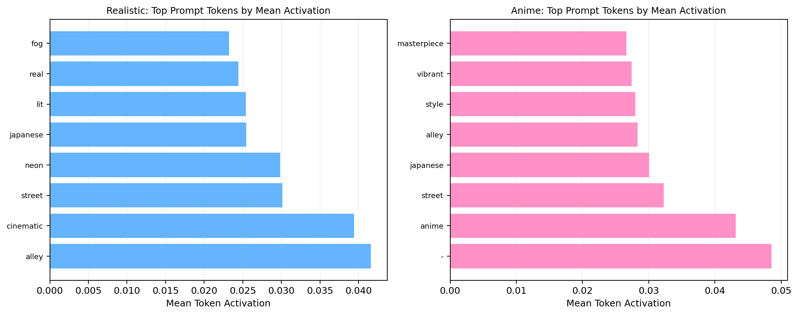

# Diffulizer

<p align="center">
  
</p>

Diffulizer is an interpretability-first diffusion inspection system built around **Stable Diffusion XL (SDXL Base 1.0)**.
It captures internal denoising traces (latents, predicted noise, cross/self-attention, token activations), serializes them into a static dataset, and renders them in a scroll-synchronized interactive viewer.

The goal is to make the reverse diffusion process measurable and explainable, not just visually impressive.

## What This Project Contains

- `data-generator/`: offline SD/SDXL instrumentation pipeline that exports reproducible artifacts per timestep.
- `visualizer/`: React + Vite app that loads exported artifacts and lets users inspect denoising dynamics.
- `visualizer/public/datasets/presets/{realistic,anime}`: bundled SDXL runs used by the website.

---

## Diffusion Theory (Applied Here)

### 1) Forward process (training-time reference)
A clean sample is progressively noised:

```text
x_t = sqrt(alpha_bar_t) * x_0 + sqrt(1 - alpha_bar_t) * epsilon,  epsilon ~ N(0, I)
```

### 2) Reverse process (inference-time process inspected in Diffulizer)
At each timestep `t`, UNet predicts noise and scheduler updates latent state:

```text
epsilon_theta = UNet(x_t, t, c)
x_{t-1} = SchedulerStep(x_t, epsilon_theta, t)
```

### 3) Classifier-Free Guidance (CFG)
Diffulizer exports with CFG when `cfg_scale > 1`:

```text
epsilon_cfg = epsilon_uncond + s * (epsilon_text - epsilon_uncond)
```

where `s = cfg_scale`.

### 4) What is captured per step
- latent state `x_t`
- predicted noise `epsilon_theta`
- decoded image preview
- cross-attention maps (token-conditioned spatial influence)
- self-attention maps (spatial-spatial coupling)
- derived trajectory and information metrics

---

## End-to-End Technical Pipeline



---

## Exported Dataset Schema

Each run exports:

```text
<run>/
  metadata.json
  metrics.json
  latent_pca.json
  images/step_000.png ...
  attention/cross/*.bin
  attention/self/*.bin
  validation.json
  (optional) latents_noise_fp16.npz
```

### `metadata.json`
Contains generator provenance and alignment-critical fields:

- model + scheduler context (`generator.*`)
- prompt text and tokenizer outputs (`prompt.tokens`, `prompt.token_ids`)
- timestep schedule (`timesteps`)
- image path list (`images`)
- recorded layer registry (`layers`)
- binary tensor index (`attention_files`, with `path`, `shape`, `dtype`)

### `metrics.json`
Core stepwise analytic channels:

- `latent_l2_norm`
- `predicted_noise_l2_norm`
- `cosine_similarity_to_previous`
- `attention_kl_divergence`
- `cross_attention_entropy`
- `self_attention_entropy`
- `mean_token_activation`
- `token_dominance`

### `latent_pca.json`
2D latent trajectory embedding:

- `points`: PCA projection of flattened latents by step
- `explained_variance_ratio`: compactness of 2D approximation

---

## Metric Semantics (ML Interpretation)

| Metric | What it measures | Typical interpretation |
|---|---|---|
| `latent_l2_norm` | Magnitude of latent state | Large early updates; stabilizes as structure converges |
| `predicted_noise_l2_norm` | Magnitude of predicted residual noise | Should generally decay as denoising progresses |
| `cosine_similarity_to_previous` | Directional similarity between consecutive latents | High values indicate smooth trajectory; drops indicate semantic reconfiguration |
| `attention_kl_divergence` | Distribution shift in token attention between steps | Spikes indicate attention reallocation events |
| `cross_attention_entropy` | Concentration vs dispersion of token attention over space | Lower entropy = sharper token localization |
| `token_dominance` | Average per-token influence over the run | Identifies prompt tokens that steer generation most |

---

## Visual Diagnostics (Generated From This Repo)

### Diffusion evolution strip (noise to structure)



### Latent trajectory in PCA space



### Core denoising metrics over timesteps



### Token dominance (top activated prompt tokens)



---

## Reproducible Setup

### 1) Prerequisites

- Python `>=3.10`
- Node.js `>=20`
- npm `>=10`
- CUDA GPU recommended for SDXL generation

### 2) Install generator dependencies

```bash
cd data-generator
python -m venv .venv
source .venv/bin/activate
pip install -r requirements.txt
```

### 3) Configure Hugging Face access token

```bash
export HF_TOKEN=<your_hf_token>
```

### 4) Generate an instrumented SDXL run

```bash
python generate.py \
  --prompt "A narrow neon-lit alley at night, wet pavement reflecting lantern light, cinematic lighting." \
  --negative-prompt "blurry, low quality, jpeg artifacts" \
  --model-id "stabilityai/stable-diffusion-xl-base-1.0" \
  --pipeline-type sdxl \
  --num-steps 24 \
  --cfg-scale 7.5 \
  --height 768 \
  --width 768 \
  --max-layers 6 \
  --attention-resolution 24 \
  --self-attention-resolution 24 \
  --dtype float16 \
  --output-dir dataset/my_run \
  --overwrite-output
```

### 5) Validate exported run

```bash
python validate_dataset.py dataset/my_run --strict
```

### 6) Wire run into visualizer presets

```bash
# example: replace one preset
rm -rf ../visualizer/public/datasets/presets/realistic
cp -R dataset/my_run ../visualizer/public/datasets/presets/realistic
```

### 7) Run the viewer

```bash
cd ../visualizer
npm install
npm run dev
```

Build for production:

```bash
npm run build
npm run preview
```

---

## Generator Controls That Matter Most

- `--num-steps`: temporal resolution of denoising trace.
- `--cfg-scale`: conditioning strength vs diversity.
- `--max-layers`: attention capture breadth (affects size and speed).
- `--attention-resolution`, `--self-attention-resolution`: spatial size of exported maps.
- `--dtype`: `float16` reduces storage and transfer cost.
- `--max-dataset-mb` + `--enforce-size-limit`: hard budget controls for artifact size.

---

## Compute Notes (SDXL)

Recommended for practical throughput:

- GPU: NVIDIA 12GB+ VRAM (16GB preferred for higher headroom)
- Dtype: `float16`
- For constrained hardware, reduce:
  - `--num-steps`
  - `--max-layers`
  - attention resolutions
  - image resolution (`--height`, `--width`)

---

## Data Integrity Guarantees in Viewer

The viewer sanitizes invalid JSON numeric tokens during load:

- `NaN -> null`
- `Infinity -> null`
- `-Infinity -> null`

Missing values render as gaps/empty points rather than crashing the app, preserving trace continuity under imperfect exports.

---

## Minimal Web Layer Summary

The frontend is intentionally thin:

- static artifact loader
- synchronized timestep controls
- rendering primitives for images + metric plots
- no backend dependency for playback

Most of the technical depth is in exported diffusion-state instrumentation, not UI-side post-processing.
