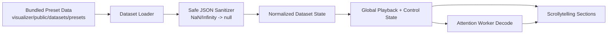
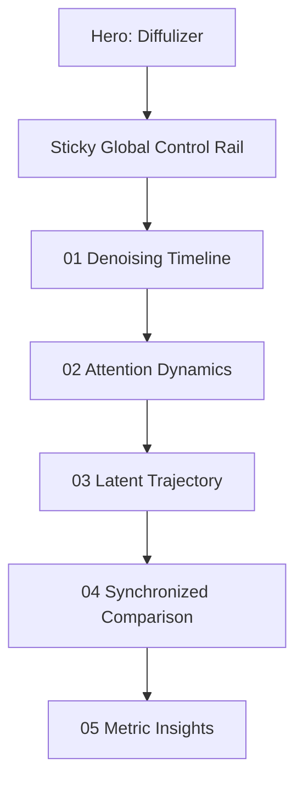
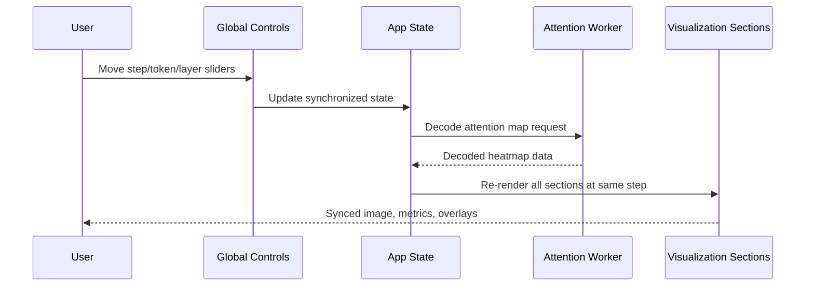

# Diffulizer

A production-ready, interactive diffusion learning website built around two curated SDXL runs.

Diffulizer is a scrollytelling + playground hybrid inspired by TensorFlow Playground and Diffusion Explainer. It lets users scrub denoising steps, inspect token attention overlays, compare latent trajectories, and read synchronized metrics side-by-side.

## Live Concept

- Title-first learning UI with centered hero: **Diffulizer**
- Hardcoded dual-run comparison:
  - `Realistic Run`
  - `Anime Run`
- Global synchronized controls:
  - step slider
  - play/pause loop
  - playback speed
  - cross-attention layer
  - token index + token label
  - attention opacity
- Advanced metrics visible at every step (entropy, KL shift, cosine drift, token activation)

## Architecture Overview



## Page Structure



## Interaction Model



## Repository Layout

```text
Diffusion_Visualizer-main/
  README.md
  visualizer/
    public/
      datasets/presets/
        realistic/
          metadata.json
          metrics.json
          latent_pca.json
          images/
          attention/
        anime/
          metadata.json
          metrics.json
          latent_pca.json
          images/
          attention/
    src/
      App.jsx
      styles.css
      config/presets.js
      hooks/usePlayback.js
      components/
        GlobalControls.jsx
        SectionHero.jsx
        SectionTimeline.jsx
        SectionAttention.jsx
        SectionTrajectory.jsx
        SectionComparison.jsx
        SectionInsights.jsx
      utils/
        datasetLoader.js
        safeJson.js
        tokenUtils.js
        attentionAccess.js
        comparison.js
        attentionWorkerClient.js
      workers/attentionWorker.js
  data-generator/            # optional offline dataset generation pipeline
```

## Why JSON Parsing No Longer Fails

Some generated `metrics.json` files contained invalid JSON values (`NaN`, `Infinity`, `-Infinity`).

Diffulizer now loads JSON as text and sanitizes invalid numeric tokens before parsing:

- `NaN` -> `null`
- `Infinity` -> `null`
- `-Infinity` -> `null`

Charts intentionally render these as **gaps** so missing measurements stay visible instead of being hidden.

## Tech Stack

- React 18
- Vite 5
- D3 (charts and paths)
- Web Worker for float16 attention decode and JS divergence

## Run Locally

### Prerequisites

- Node.js >= 20
- npm >= 10

### Start

```bash
cd visualizer
npm install
npm run dev
```

Open `http://localhost:5173`.

### Production build

```bash
cd visualizer
npm run build
npm run preview
```

## Production Readiness Checklist

- Preset datasets bundled under `public/datasets/presets`
- No runtime dependency on user-uploaded folders or local bridge services
- NaN-safe parsing for robust loading in browsers
- Worker-based heavy attention decode path retained
- Sticky synchronized controls across all story sections
- Responsive layout for desktop and mobile
- Build verified with `npm run build`

## Deployment

This is a static frontend app.

- Build output: `visualizer/dist/`
- Deploy to any static host (Vercel, Netlify, S3 + CDN, Cloudflare Pages)

Existing deploy config files are included in `visualizer/`:

- `vercel.json`
- `netlify.toml`

## Optional: Regenerating Datasets

If you want new runs later, use `data-generator/` and then replace the two preset folders in:

- `visualizer/public/datasets/presets/realistic`
- `visualizer/public/datasets/presets/anime`

No frontend code changes are required as long as dataset schema remains compatible.

## Troubleshooting

### Blank panel or failed metrics

- Confirm both preset folders contain:
  - `metadata.json`
  - `metrics.json`
  - `latent_pca.json`
  - `images/`
  - `attention/`

### App loads but attention is missing

- Verify `metadata.json -> attention_files` paths point to existing `.bin` assets.

### Build fails

- Use Node 20+
- Remove lockfile drift by reinstalling:

```bash
cd visualizer
rm -rf node_modules
npm install
npm run build
```

---

Diffulizer is designed for interpretability-first storytelling: synchronized controls, explicit missing-data semantics, and side-by-side denoising behavior that users can actually reason about.
